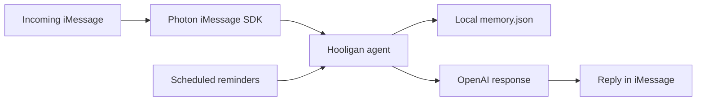

# Hooligan

**An iMessage-native AI sidekick for deciding what to do, where to go, and how to spend free time.**

Hooligan is a conversational planning agent that runs inside iMessage. Instead of opening another app, the user texts it like a friend: “I have two hours,” “coffee + views,” or “planning a trip.” The agent asks follow-up questions, remembers lightweight preferences, avoids repeating suggestions, and can send scheduled nudges during the day.

## Why this exists

Planning small moments often takes more effort than the moment itself. People bounce between maps, notes, group chats, saved posts, and recommendation apps just to answer a simple question: what should I do now?

Hooligan explores a lower-friction interaction:

> What if planning felt like texting a friend instead of operating another app?

## What it does

- Responds to iMessage conversations through the Photon iMessage SDK.
- Maintains lightweight local memory for visited and liked places.
- Uses OpenAI responses for short, conversational planning.
- Avoids repeating suggestions already stored in memory.
- Supports proactive reminders such as morning and midday check-ins.
- Keeps the interaction text-first: no custom UI, no separate app surface.

## How it works



## Setup

Clone the repository:

```bash
git clone https://github.com/jayasrisng/hooligan-agent.git
cd hooligan-agent
```

Install dependencies:

```bash
npm install
```

Create a `.env` file in the repository root:

```bash
OPENAI_API_KEY=your_openai_api_key
MY_NUMBER=+1XXXXXXXXXX
```

Notes:

- Include the country code in `MY_NUMBER`.
- Never commit `.env`.
- `memory.json` is local runtime state and should not be treated as public data.

Run the agent:

```bash
npx tsx hooligan-agent.ts
```

## Example flow

```text
you: hey
hooligan: hey where are you rn 👀

you: honolulu
hooligan: what are we feeling today
          chill / coffee / outdoors / chaotic / aesthetic

you: coffee + views
hooligan: how much time + budget?

you: 2 hours
hooligan: suggests a plan
```

## Memory

Hooligan stores simple preference state locally:

- places the user has tried;
- places or activities the user liked.

This state is stored in `memory.json` so future suggestions can avoid repetition and reflect prior feedback.

## Proactive messages

The current prototype uses Photon reminders for scheduled nudges:

- 9 AM — morning check-in;
- 2 PM — midday suggestion.

These times can be changed in the code.

## Tech stack

- Photon iMessage SDK
- OpenAI API
- TypeScript
- Node.js
- Local JSON memory

## Case study

See [docs/case-study.md](docs/case-study.md) for the product and implementation notes.

## Current limitations

- Experimental local build.
- Requires macOS/iMessage environment support through Photon.
- Memory is local JSON, not a production storage layer.
- The agent needs stronger guardrails before handling sensitive personal plans or locations.

## Future work

- Add typed memory schema and validation.
- Add opt-in controls for proactive reminders.
- Add safer handling for location, schedule, and preference data.
- Add tests around memory update behavior.
- Add a dry-run mode for demoing without sending real iMessages.
